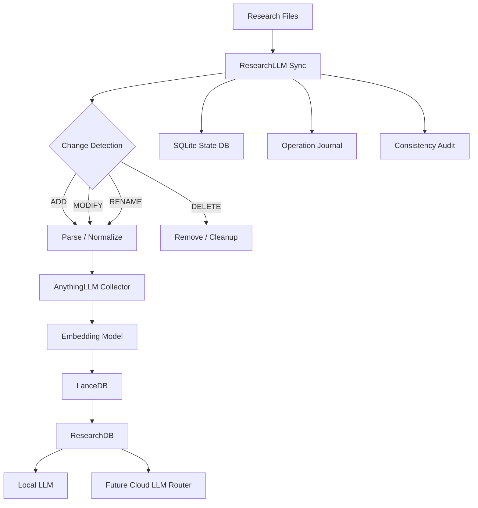

# ResearchLLM

> A local-first research knowledge infrastructure project for automatic indexing, traceable retrieval, and long-term scientific knowledge management.

ResearchLLM started from a simple question:

> **Can a research knowledge base stay continuously synchronized with real project folders instead of relying on manual document uploads?**

The project is evolving from a local RAG prototype into a research knowledge infrastructure layer that can monitor heterogeneous project assets, preserve provenance, recover from interruptions, and support increasingly structured scientific retrieval.

---

## Overview

Most RAG demos assume:

```text
Upload a few PDFs
        ↓
Create embeddings
        ↓
Ask questions
```

Real research projects are different. They contain papers, reports, source code, JSON/YAML, CSV/Excel, MATLAB, C/C++, Python, experiment logs, configuration files, presentations, notes, Git history, and simulation outputs.

Those assets are continuously added, modified, renamed, and deleted.

ResearchLLM is designed around this workflow:

```text
Research project folders
        ↓
Automatic change detection
        ↓
Parsing / normalization
        ↓
Embedding and indexing
        ↓
Consistency tracking
        ↓
Retrieval
        ↓
Local / optional cloud LLM
        ↓
Traceable research answers
```

The core design principle is:

> **The research directory is the Source of Truth.**

Indexes, vector databases, caches, and models should remain replaceable or rebuildable.

---

## Current Architecture



Current stack:

```text
AnythingLLM       → RAG interface, workspace, collector
Ollama            → local model runtime
Qwen3             → local generation models
Qwen3 Embedding   → local embeddings
LanceDB           → vector database
SQLite            → synchronization state + operation journal
ResearchLLM Sync  → custom lifecycle and synchronization layer
```

---

## What Has Been Built

### Local RAG Baseline

A fully local RAG pipeline is operational:

```text
Document
↓
AnythingLLM
↓
Local Embedding
↓
LanceDB
↓
Retriever
↓
Local LLM
↓
Answer
```

The pipeline has been validated using real research documents containing domain-specific parameters, numerical values, scenario labels, and version identifiers.

### Automatic Research Folder Synchronization

ResearchLLM Sync recursively monitors a designated research root and propagates file changes into the knowledge base.

Current lifecycle support:

```text
ADD
MODIFY
DELETE
RENAME
```

Typical workflow:

```text
Drop a file into the research folder
        ↓
ResearchLLM detects it
        ↓
Parse / normalize
        ↓
Upload and embed
        ↓
Knowledge base becomes queryable
```

No manual upload step is required.

### Multi-Type Ingestion

Native document formats currently delegated to the collector include:

```text
PDF
DOCX
XLSX
PPTX
TXT
EPUB
```

Text-normalized inputs include:

```text
Markdown
JSON / JSONL
YAML
CSV / TSV
Python
MATLAB
C / C++
JavaScript / TypeScript
Java
Go
Rust
Shell
SQL
LaTeX
Logs
Configuration files
Jupyter notebooks
```

Normalized assets receive provenance metadata such as:

```text
source_path
collection
project
original_filename
original_extension
sha256
```

---

## ResearchLLM Sync v0.2.1

The synchronization layer has moved beyond basic CRUD and now includes reliability mechanisms for long-running use.

### Rename Detection

A rename can be identified when:

```text
old path disappears
+
new path appears
+
SHA256 remains identical
```

ResearchLLM records it as:

```text
RENAME
old_path -> new_path
```

rather than treating it only as an unrelated delete/add pair.

Because provenance metadata changes with the path, renamed files can be re-indexed to preserve correct source references.

### Duplicate Detection

Identical content does not automatically imply identical research meaning.

```text
Project-A/config.json
Project-B/config.json
```

may have the same SHA256 but belong to different project contexts.

ResearchLLM therefore detects duplicate content while preserving both logical source paths.

### Operation Journal

Mutating operations are journaled:

```text
pending
↓
remote operation
↓
local state update
↓
committed
```

This provides a basis for recovering from interrupted synchronization.

### Crash Recovery

Crash recovery has been tested with a deliberately simulated interrupted transaction.

Observed sequence:

```text
unfinished operation detected
↓
rollback incomplete transaction
↓
rescan Source of Truth
↓
re-apply current file state
↓
upload / embed
↓
commit
```

The recovered file was subsequently retrievable with the correct source provenance.

### Safer Modify Transactions

The newer modify order is designed to reduce the chance of losing the last known-good indexed version:

```text
upload replacement
↓
confirm new remote location
↓
record transaction state
↓
remove stale version
↓
update local state
↓
commit
```

### Orphan Detection and Cleanup

ResearchLLM can audit differences between:

```text
source files
state database
remote documents
```

and detect:

```text
untracked source
missing source
missing remote object
orphan remote document
duplicate groups
```

Permanent orphan deletion is intentionally explicit rather than automatic.

### Single-Worker Safety

Mutating modes use an exclusive process lock:

```text
continuous sync    → exclusive
one-shot sync      → exclusive
orphan cleanup     → exclusive

status             → read-only
audit              → read-only
```

Read-only inspection remains available while the background worker is active.

---

## Verified Behavior

| Capability | Status |
|---|---|
| Add file | PASS |
| Modify file | PASS |
| Delete file | PASS |
| Rename file | PASS |
| Duplicate detection | PASS |
| Background synchronization | PASS |
| Automatic embedding | PASS |
| RAG retrieval | PASS |
| Source provenance | PASS |
| Persistent model configuration | PASS |
| Operation journal | PASS |
| Crash recovery | PASS |
| Single-worker protection | PASS |
| Status while worker is running | PASS |
| Audit while worker is running | PASS |
| Orphan detection | PASS |
| Orphan cleanup | PASS |
| Database schema migration | PASS |
| Consistency audit | PASS |

Current stable synchronization baseline:

```text
ResearchLLM Sync v0.2.1
STABLE BASELINE
```

---

## Engineering Principles

### Source files are durable; infrastructure is rebuildable

```text
Research files    = durable
Vector database   = rebuildable
Embedding index   = rebuildable
Cache             = rebuildable
Model             = replaceable
```

### Provenance is part of the answer

The target is not only to answer *what*, but also *where*:

```text
file path
page number
slide number
sheet
cell range
JSON path
function
class
symbol
line range
Git commit
```

### Current evidence should outrank stale chat history

A useful failure mode observed during development was that an updated database value could conflict with an older answer retained in conversation history.

Future retrieval policy should make current indexed evidence authoritative for questions such as:

```text
current
latest
now
```

### Reliability before convenience

Lower synchronization latency is useful, but crash recovery, consistency, provenance, and lifecycle management are higher priorities.

---

## Current Limitations

ResearchLLM is still under active development.

```text
Source code
→ indexable, but not yet fully symbol-aware

JSON / YAML
→ searchable, but not yet first-class JSONPath provenance

Excel
→ ingestible, but not yet exact sheet/cell provenance

PowerPoint
→ ingestible, but not yet slide-level provenance

PDF
→ ingestible, but fine-grained page/section provenance is still evolving

Engineering/simulation project formats
→ not yet covered by dedicated parsers
```

---

## Roadmap

### Milestone 0 — Local RAG Baseline

```text
Status: COMPLETE
```

### Milestone 1 — Automatic Research Database Sync

```text
Status: COMPLETE
```

Implemented:

```text
ADD / MODIFY / DELETE / RENAME
duplicate tracking
operation journal
crash recovery
orphan cleanup
consistency audit
automatic embedding
background synchronization
```

### Milestone 2 — Multi-Format Research Parsing

```text
Status: NEXT
```

Planned structured provenance:

```text
Python / C / C++ / MATLAB
→ function / class / symbol / line range

JSON / YAML
→ key path / JSONPath

CSV
→ schema / row range

XLSX
→ workbook / sheet / cell range

PPTX
→ slide number / title

PDF
→ page / section

Jupyter
→ cell number / cell type
```

### Milestone 3 — Hybrid Retrieval

```text
Vector Search
+
Keyword / BM25
+
Code Symbol Search
+
Metadata Filters
+
Reranking
```

### Milestone 4 — Research Accuracy Mode

```text
numeric comparison checks
unit consistency
figure / table reference validation
source verification
version conflict detection
fact vs inference separation
```

### Milestone 5 — Model Routing

```text
simple query
→ small local model

complex research reasoning
→ larger local model

high-complexity cross-document analysis
→ optional cloud model

sensitive project
→ local-only policy
```

### Milestone 6 — Multi-User Research Infrastructure

```text
multi-user access
permissions
project isolation
audit logs
private deployment
shared research knowledge
historical project preservation
```

---

## Why This Project Exists

Research groups accumulate large amounts of technical knowledge across:

```text
project folders
code repositories
experiment logs
presentations
reports
papers
personal notes
```

When a project ends or a researcher leaves, the files may remain while the reasoning behind them becomes difficult to recover.

ResearchLLM explores a different possibility:

> **Models can change. People can graduate. Projects can end. The research knowledge itself should remain searchable, traceable, and reusable.**

---

## Development Status

```text
Local RAG                            COMPLETE
Automatic research synchronization  COMPLETE
Sync reliability baseline           STABLE

Next:
Structured research parsing
```

ResearchLLM is currently an experimental engineering project under active development.

This public repository intentionally contains only architecture, engineering decisions, testing methodology, and public development progress. Private research data, credentials, internal project materials, deployment-specific paths, and secrets are excluded.
