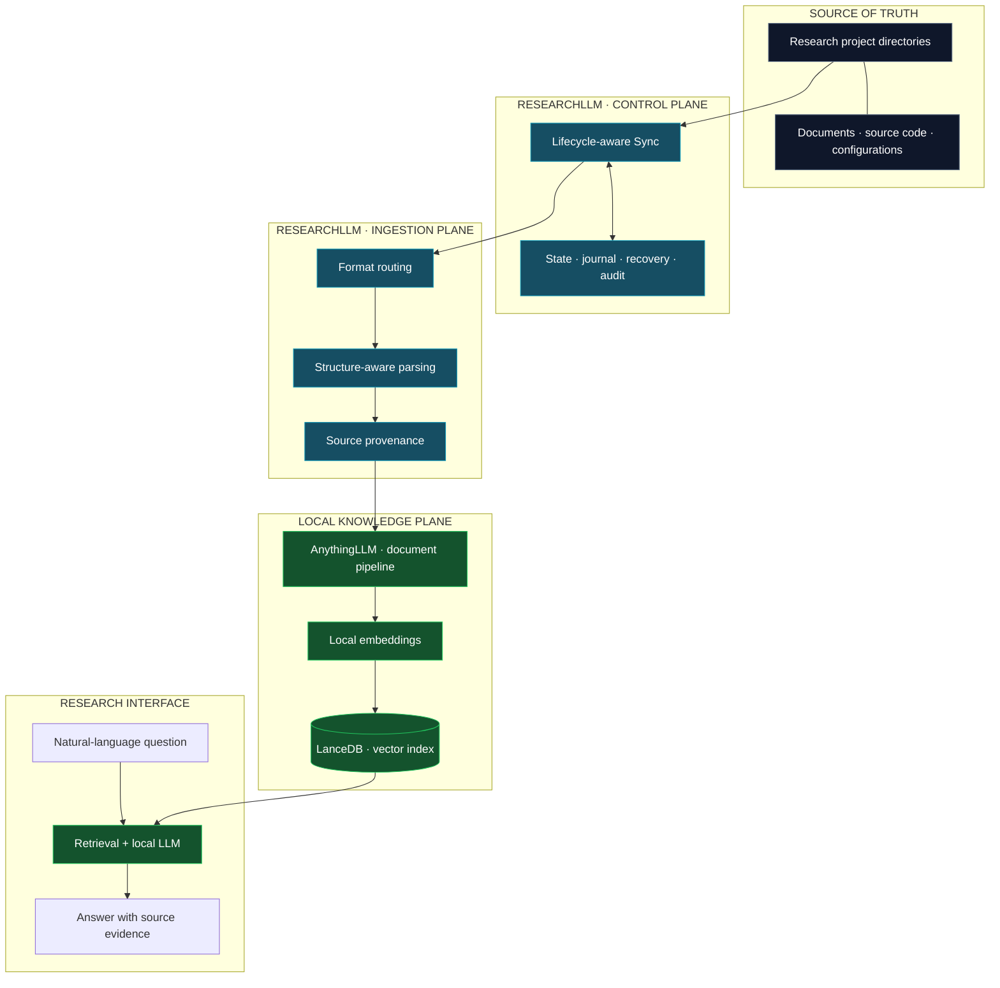
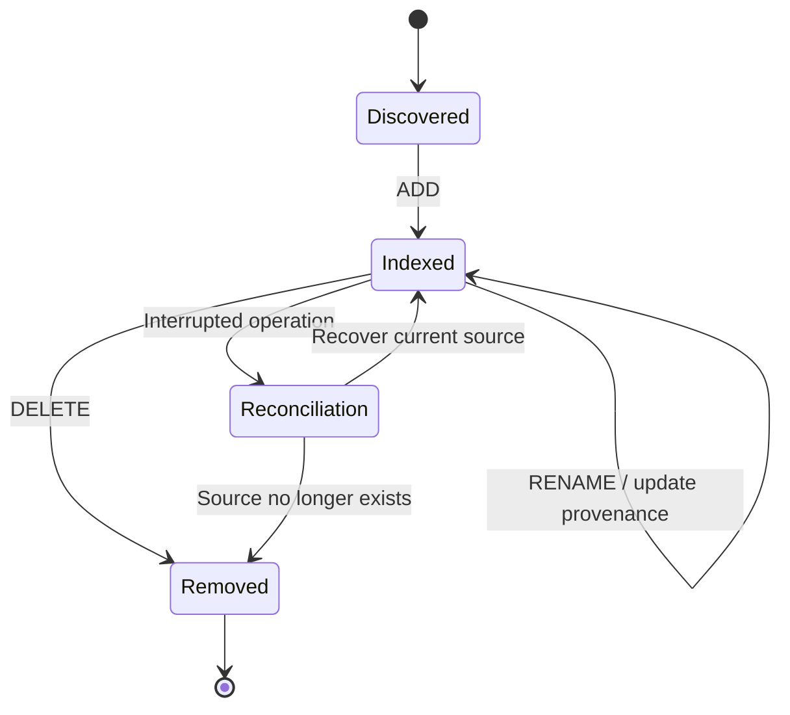
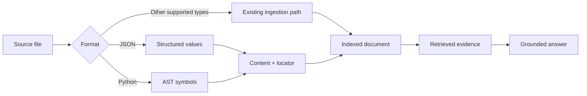
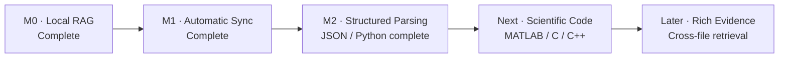

<div align="center">

# ResearchLLM

### Research knowledge, beyond document chat.

**A local-first research knowledge infrastructure for continuously evolving scientific projects.**

*Automatic synchronization · Structure-aware parsing · Verifiable provenance · Reliable indexing*

[](#project-status)
[](#engineering-status)
[](#engineering-status)
[](#validation)
[](#architecture)

**[Architecture](#architecture)** · **[Capabilities](#capabilities)** · **[Validation](#validation)** · **[Roadmap](#roadmap)** · **[Project status](#project-status)**

</div>

---

## The idea

Research doesn't live in a chat window. It lives in changing project directories: source code, experiment configurations, datasets, papers, reports, notebooks, and results.

Traditional document-centric RAG starts with **upload → embed → ask**. ResearchLLM explores a different abstraction:

> **Treat the research directory as the source of truth. Treat everything derived from it as replaceable infrastructure.**

That means making changes discoverable, references traceable, and the knowledge index recoverable as projects evolve.

```text
                  RESEARCH FILES ARE THE SOURCE OF TRUTH
                                     │
                   Continuous synchronization + provenance
                                     │
                    Structure-aware research knowledge
                                     │
                       Grounded, traceable answers
```

## Architecture

### 01 / System overview

The current prototype combines a custom research synchronization layer with an [AnythingLLM](https://github.com/Mintplex-Labs/anything-llm)-based retrieval environment and local model inference.



**Architectural boundary:** source files are durable research assets; indexes and embeddings are derived representations. The prototype is intentionally designed around that separation.

### 02 / Document lifecycle

A research file is not static. The indexing system needs to respond to its lifecycle rather than only its first upload.



The tested sync baseline includes modification and rename handling, an operation journal, recovery from a **simulated** interrupted transaction, consistency audits, and explicit cleanup of stale managed documents.

### 03 / From bytes to evidence

The first structure-aware parser release supports JSON key paths and Python source symbols. It is designed to keep the original location attached to the extracted content.



For example, on **synthetic test data**:

```text
Question  What is the configured maximum motor speed?
Answer    20,480 RPM
Source    Projects/Example/settings.json
Locator   $.motor.max_rpm
```

```text
Question  Where is the conversion method defined?
Symbol    ParserMotorController.pwm_to_rpm
Source    Projects/Example/controller.py
Lines     4–6
```

These examples illustrate verified JSON/Python locator behavior in controlled tests—not a claim of universal citation accuracy across all document types.

---

## Capabilities

| Layer | Implemented and tested | Scope |
|:--|:--|:--|
| **Local knowledge pipeline** | Local embedding, vector search, model-grounded Q&A | Research documents |
| **Folder synchronization** | ADD · MODIFY · DELETE · RENAME | Watched research files |
| **Integrity** | Content fingerprints, tracked state, consistency audit | Managed documents |
| **Reliability** | Operation journal, single-worker protection, simulated crash recovery | Sync baseline |
| **Lifecycle hygiene** | Orphan detection and explicit cleanup | Managed remote records |
| **Structured parsing** | JSON paths and Python AST symbols / line ranges | JSON and Python |
| **Provenance** | Source paths and format-specific locators | Validated synthetic cases |
| **Daily workflow** | Automatic parser activation through the standard launcher | Local prototype |

### Format coverage is not the same as structural understanding

The existing ingestion pipeline accepts multiple text-like and common document formats. **Deep structural extraction has only been validated for JSON and Python.** MATLAB, C/C++, spreadsheets, PDFs, and other research assets do not yet have the same verified source-location guarantees.

This distinction is deliberate: an indexable file is not necessarily a structurally understood file.

---

## Validation

The project is developed through incremental testing rather than feature claims alone.

**Parser v0.3.0 — controlled validation**

```text
Offline automated tests              32 / 32  PASS
JSON + Python structured ingestion           PASS
Current-value retrieval after MODIFY          PASS
Updated source paths after RENAME             PASS
Index cleanup after DELETE                    PASS
Automatic parsing via everyday launcher       PASS
Final managed-document consistency audit      PASS
```

A separate sync baseline was tested for file lifecycle operations, orphan cleanup, and recovery after a deliberately simulated interrupted ADD transaction.

**Known boundary:** a combined query once failed to retrieve the relevant JSON evidence while a focused JSON query succeeded. Multi-file recall and evidence coverage remain active areas of investigation. These tests are neither a large-scale benchmark nor a production reliability guarantee.

---

## Engineering status

| Component | Baseline | State |
|:--|:--|:--|
| ResearchLLM Sync | **v0.2.1** | Stable *tested baseline* |
| JSON / Python Structured Parser | **v0.3.0** | Stable *tested baseline* |
| Structured MATLAB / C / C++ parsing | — | Planned |
| Cross-format, multi-file retrieval improvements | — | Planned |

> **Versioning note:** `Sync v0.2.1` and `Parser v0.3.0` are separate component versions. This is not a claim that every ResearchLLM subsystem is at v0.3.0.

---

## Design principles

**01 · Source-of-truth architecture**  
Keep primary research assets independent of models and indexes.

**02 · Provenance over plausible answers**  
A useful scientific answer identifies supporting evidence, not only a conclusion.

**03 · Lifecycle awareness**  
Updated and removed source files must not silently coexist with obsolete knowledge.

**04 · Failure-aware engineering**  
Auditability and recovery are part of the design, not afterthoughts.

**05 · Composable components**  
Ingestion, indexing, and generation should have clean boundaries.

---

## Roadmap



The next public technical priorities are richer scientific-code parsing and improved retrieval across multiple files. Broader functionality will be announced only after validation.

---

## Technology

| Area | Foundation |
|:--|:--|
| Knowledge workspace and document pipeline | [AnythingLLM](https://github.com/Mintplex-Labs/anything-llm) |
| Local model runtime | [Ollama](https://ollama.com/) |
| Local language and embedding models | Qwen family |
| Vector index | LanceDB |
| Sync state and operation tracking | SQLite |
| Structural extraction | Python AST / JSON parsing |

ResearchLLM builds on existing open-source foundations. Their respective trademarks and licenses remain with their owners.

---

## Project status

**Research prototype · Updated 2026-10-09**

This repository is a **public technical showcase** for the ResearchLLM project. It documents high-level architecture, engineering decisions, validated functionality, and development progress. It is **not currently an installable public source release**; internal source, research materials, test datasets, and deployment-specific configuration are not distributed here.

The published tests establish a controlled development baseline, not a claim of commercial readiness, comprehensive format support, or audited security.

<div align="center">

---

**Research files are the source of truth. Everything derived from them should be accountable.**

*ResearchLLM · Built for evolving research.*

</div>
